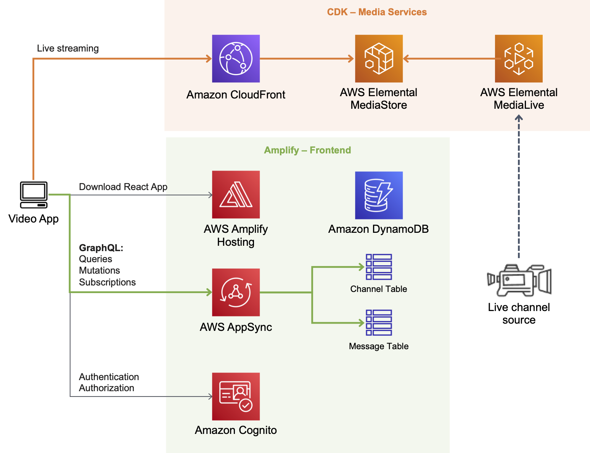

# Live streaming with AWS Media Services and Chat Application with AWS AppSync



### Prerequisites

Work in your local or [AWS Cloud9](https://aws.amazon.com/cloud9/) environment with the following 

1. [AWS CLI configured with IAM Credentials](https://docs.aws.amazon.com/cli/latest/reference/configure/)
2. [Amplify CLI](https://docs.amplify.aws/cli/start/install)
3. [CDK CLI](https://docs.aws.amazon.com/cdk/latest/guide/getting_started.html#getting_started_install)

## Frontend application with Amplify

### 1. Create and initialize Amplify project

Create react application and install dependencies.

``` bash
npx create-react-app amplify-video-frontend
cd amplify-video-frontend
npm install aws-amplify aws-amplify-react @aws-amplify/ui-react @material-ui/core @material-ui/icons video.js
```

Initialize the Amplify project with the following configurations.

``` bash
amplify init
```

* Enter a name for the project **amplifyvideofrontend**
* Enter a name for the environment **dev**
* Choose your default editor: **Visual Studio Code** (Your preferred editor)
* Choose the type of app that you're building **javascript**
Please tell us about your project
* What javascript framework are you using **react**
* Source Directory Path: **src**
* Distribution Directory Path: **build**
* Build Command: **npm run-script build**
* Start Command: **npm run-script start**
Using default provider awscloudformation
* Do you want to use an AWS profile? **Yes**
* Please choose the profile you want to use **default** (Your profile crdentials)

### 2. Add Authentication

Use the default configuration for authentication...

``` bash
amplify add auth
```

* Do you want to use the default authentication and security configuration? **Default configuration**
* How do you want users to be able to sign in? **Username**
* Do you want to configure advanced settings? **No, I am done.**

``` bash
amplify push
```

* Are you sure you want to continue? **Yes**

### 2. Add API (GraphQL)

``` bash
amplify add api
```

* Please select from one of the below mentioned services: **GraphQL**
* Provide API name: **amplifyvideofrontend**
* Choose the default authorization type for the **API Amazon Cognito User Pool**
Use a Cognito user pool configured as a part of this project.
* Do you want to configure advanced settings for the GraphQL API **No, I am done.**
* Do you have an annotated GraphQL schema? **No**
* Choose a schema template: **Single object with fields (e.g., “Todo” with ID, name, description)**
* Do you want to edit the schema now? **Yes**

Edit the schema by openning the new `schema.graphql` file in your editor, replace with the following [schema](amplify-video-frontend/amplify/backend/api/amplifyvideofrontend/schema.graphql):

```
type Channel @model {
  id: ID!
  name: String!
  url: String!
  createdAt: String
  messages: [Message] @connection(keyName: "byChannel", fields: ["id"])

}

enum ModelSortDirection {
  ASC
  DESC
}

type Message @model(subscriptions: null)
@key(name: "byChannel", fields: ["channelId", "createdAt"], queryField: "listMessagesByChannel")
{
  id: ID!
  channelId: ID!
  username: String!
  content: String!
  createdAt: String
  channel: Channel @connection(fields: ["channelId"], sortField: "createdAt")
}

type Subscription {
  onCreateMessage(channelId: ID): Message @aws_subscribe(mutations: ["createMessage"])
}
```

Once you are happy with your schema, save the file and deploy your new API.

``` bash
amplify push
```

* Are you sure you want to continue? **Yes**
* Do you want to generate code for your newly created GraphQL API **Yes**
* Choose the code generation language target **javascript**
* Enter the file name pattern of graphql queries, mutations and subscriptions **src/graphql/**/*.js**
* Do you want to generate/update all possible GraphQL operations - queries, mutations and subscriptions **Yes**
* Enter maximum statement depth [increase from default if your schema is deeply nested] **2**

### 3. Create/Replace React application files

Update the following files in your React application.

* [src/index.js](amplify-video-frontend/src/index.js)
* [src/App.js](amplify-video-frontend/src/App.js)
* [public/index.html](amplify-video-frontend/public/index.html)

Create the following files in your React application.

* [src/components/VideoPlayer.js](amplify-video-frontend/src/components/VideoPlayer.js)
* [src/components/VideoChat.js](amplify-video-frontend/src/components/VideoChat.js)
* [src/components/DialogVideoChat.js](amplify-video-frontend/src/components/DialogVideoChat.js)

### 4. Add Hosting

For this exercise we are going to choose manual deploys allows you to publish your web app to the Amplify Console without connecting a Git provider.

``` bash
amplify add hosting
```

* Select the plugin module to execute **Hosting with Amplify Console (Managed hosting with custom domains, Continuous deployment)**
* Choose a type **Manual deployment**

``` bash
amplify publish
```

* Are you sure you want to continue? **Yes**

## Media Services with CDK

### 1. Create and initialize CDK project

``` bash
mkdir cdk-media-services
cd cdk-media-services
# Initialize the AWS CDK project
cdk init -l typescript
# Install the npm modules
npm install @aws-cdk/aws-medialive @aws-cdk/aws-mediastore @aws-cdk/aws-cloudfront @aws-cdk/aws-iam
```

### 2. Add services to the stack

Update the following files.

* [lib/cdk-media-services-stack.ts](cdk-media-services/lib/cdk-media-services-stack.ts)
* [bin/cdk-media-services.ts](cdk-media-services/bin/cdk-media-services.ts)
* [test/cdk-media-services.test.ts](cdk-media-services/test/cdk-media-services.test.ts)

### 3. Deploying the stack services

Deploy the CDK stack with the following commands.

``` bash
npm run build
# see the difference before the deployment
cdk diff
# deploy it
cdk deploy
```

Outputs:

* CdkMediaServicesStack.DataEndpoint
* CdkMediaServicesStack.MediaLiveEndpoint
* CdkMediaServicesStack.MediaLiveInputID
* CdkMediaServicesStack.PlaybackURL